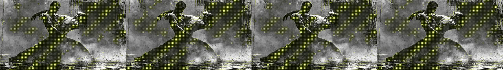
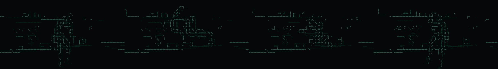
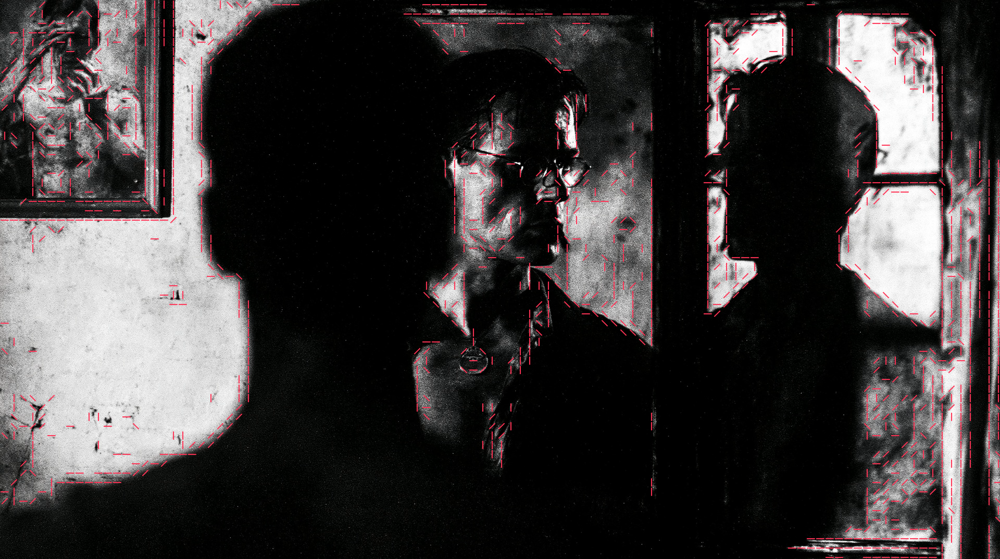
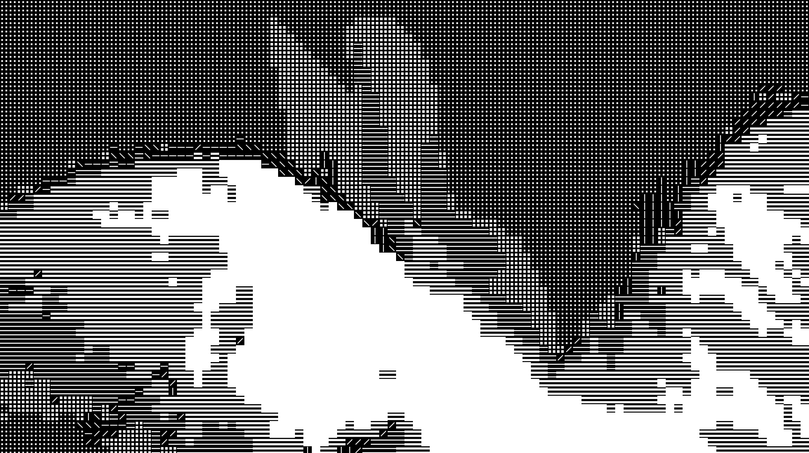

# MSCH Edge ASCII showcase

Examples supplied by Mario from the MSCH Node Showcase collection. The output files are preserved as supplied.

Traces contours with short strokes and fills tones with dot/stripe/block glyphs. Animates a still photo into an MP4, or processes an existing video while keeping fps and audio.

- dancers_flow.mp4 - one photo, 4 s @ 24 fps, mode=mixed, animation=flow (brightness waves travel across the glyph grid), yellow
- robot_video_edges.mp4 - VIDEO input, mode=edge_only on a solid dark background, animation=pulse, mint strokes
- full_ascii_still - frames node, mode=full_ascii with fill_amount=1.0 (dense screenshot look), white on black
- edge_only_still - frames node, mode=edge_only, red strokes over the original photo

## Gallery

Click a video preview to open its file on GitHub, or use the download link.

### Dancers flow

[Open MP4](outputs/dancers_flow_00002_.mp4) · [Download original](https://github.com/mariobilly/msch-edge-ascii/raw/refs/heads/main/examples/showcase/outputs/dancers_flow_00002_.mp4)

### Robot video edges

[Open MP4](outputs/robot_video_edges_00001_.mp4) · [Download original](https://github.com/mariobilly/msch-edge-ascii/raw/refs/heads/main/examples/showcase/outputs/robot_video_edges_00001_.mp4)

## Still images and diagnostic outputs

### Edge only still

### Full ascii still

## API workflows

These JSON files are ComfyUI API prompts, not canvas-format workflows. Send one as the `prompt` field of a `/prompt` request, or use a tool that accepts API workflows. A canvas importer may require conversion.

Choose your own source media and installed models before running. Source photos, video clips, audio and model weights are not bundled in this showcase. The supplied render settings and connections are retained; machine-specific absolute paths in the API copies use `INPUT_ROOT/` or `LOCAL_FILES/` placeholders. Replace these with paths valid on your computer.

- [edge_ascii_photo_api.json](workflows_api/edge_ascii_photo_api.json): `EdgeASCII`, `LoadImage`, `MschEdgeASCIIVideo`, `SaveImage`, `SaveVideo`.
- [edge_ascii_video_api.json](workflows_api/edge_ascii_video_api.json): `LoadVideo`, `MschEdgeASCIIVideo`, `SaveVideo`.

### Input files and models

| Workflow | Node | Input | Source selection |
|---|---|---|---|
| `edge_ascii_photo_api.json` | `1` | `image` | `msch_showcase/stills/dancers.jpg` |
| `edge_ascii_photo_api.json` | `4` | `image` | `msch_showcase/stills/rabbit.jpg` |
| `edge_ascii_photo_api.json` | `7` | `image` | `msch_showcase/stills/silhouette.jpg` |

## Source notes

The collection notes identify images from the Jim Morrison image library, Mario’s clips, and the Suno track “Crushing Syncopation”. Those source assets are not included separately. The rendered media is supplied as showcase material; the repository’s MIT license describes the node code and does not establish a separate license for underlying media.
